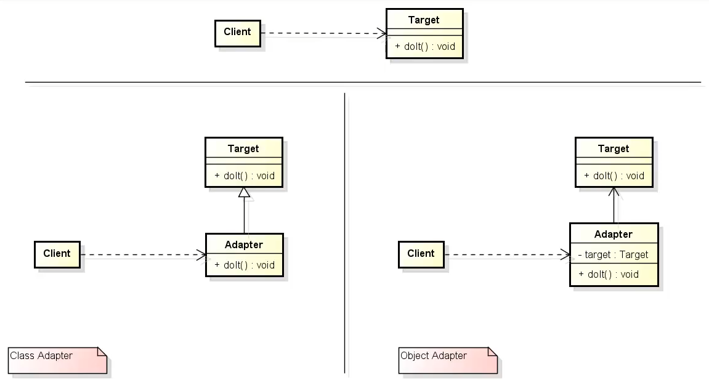

# Abstract Factory

- Permite que duas interfaces que não tinha nada a ver uma com a outra possam a partir dele se encaixar/conectar.
- Permite que a comunicação com bibliotecas externas fique centralizado permitindo um menor acoplamento com o restante da aplicação.

**Problemática¹:** Informação produzida pelo "target" não é entendida pelo "target" ou eles não conversão corretamente.

**Problemática²:** Você possui uma dependência externa e não quer que sua aplicação fique muita acoplada a essa dependência, ex.: biblioteca, framework ou api.

**Porque ela é tão interessante?** 
Proporciona desacoplamento, faz a intermediação dos dados de um api ou biblioteca externa de modo que sua comunicação fica centralizada, facilita manutenção futura e a extensão de código.

**Soluções:** [Adaptador de classe](src/github/adapter/TemperatureClassAdapter.java), [Adaptador de objeto](src/github/adapter/TemperatureObjectAdapter.java).

**Arquitetura:** 

