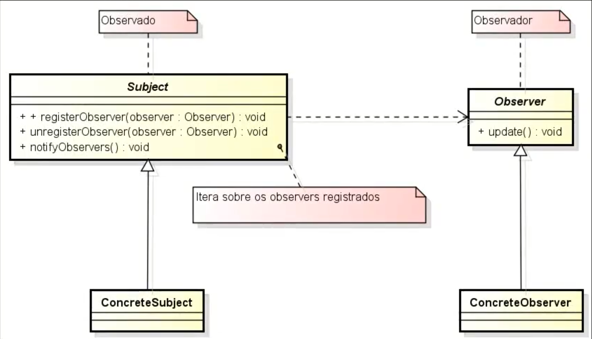

# Observer

Para entender o **Observer** precisamos primeiro olhar para as suas duas interfaces base o Subject(Observado) e o Observer(Observador) e podemos ilustrar com o seguinte cenário:
 - Alguns pacientes(Observador) de uma determinada clínica tinham uma consulta marcada para um determinado dia(essa "agenda" é o sujeito observado), porém ocorreu um imprevisto com o médico e a consulta terá que ser remarcada e para isso os pacientes teram que quer notificados.

**Problemática:** Vamos dizer que você identificou uma necessidade em que um comportamento que deve ser observado e existe uma quantidade considerável que pode ser variável de observadores que devem ser acionados quando algo mudar de acordo o que aconteça com esse objeto observado.

**Solução:** [Usando diferentes observadores para um mesmo sujeito observado](src/github/observer/App.java).

**Arquitetura:** 

