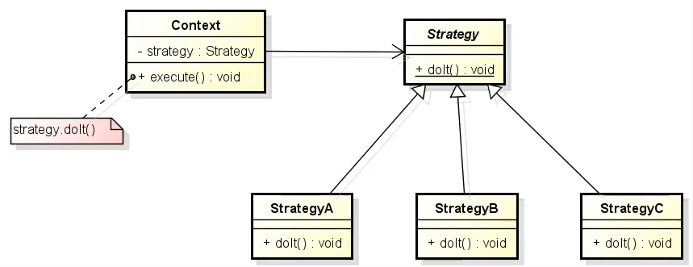

# Strategy

Para entender o **Strategy**, o "coração" desse padrão é uma interface/classe abstrata que vamos chamar de "Strategy"
essa abstração dará a estrutura para as classes que a implementam de forma específica, aqui entra a figura do "Context"
que é quem vai fazer o meio de campo entre a chamada do algoritmo pelo cliente e o algoritmo em si, quando o Context for
chamado será passado/injetado a "estratégia" que será usada na execução.

**Problemática:** suponha que você tenha uma série de algoritmos que pertença a mesma "família",
e digamos que em algumas situações você precisa trocar um algoritmo pelo outro, de uma forma que quem vai usar esse
algoritimo não fique sabendo dessa troca, de forma que ele use sem saber como foi implementado.

**Solução:** [Injetando forma de movimento para o José](src/github/strategy/App.java).

**Arquitetura:** 

