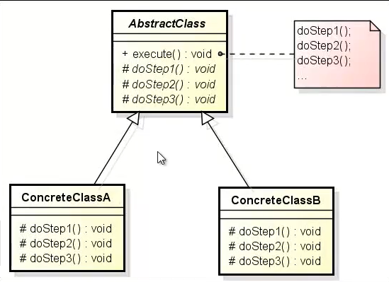

# Template Method

No **Template Method**, temos uma classe abstrata e dentro dela um método que não é abstrato, porque é um método que 
vai dispara a execução dos algoritmos, usando métodos são declarados na classe abstrata, porém implementados somente nas
classes concretas.

**Problemática:** Tendo um algoritmo bem definido você quer que alguns passos desse algoritmo sejam definidos de forma diferente.

**Solução:** [Injetando forma de movimento para o José](src/github/templatemethod/App.java).

**Arquitetura:** 

