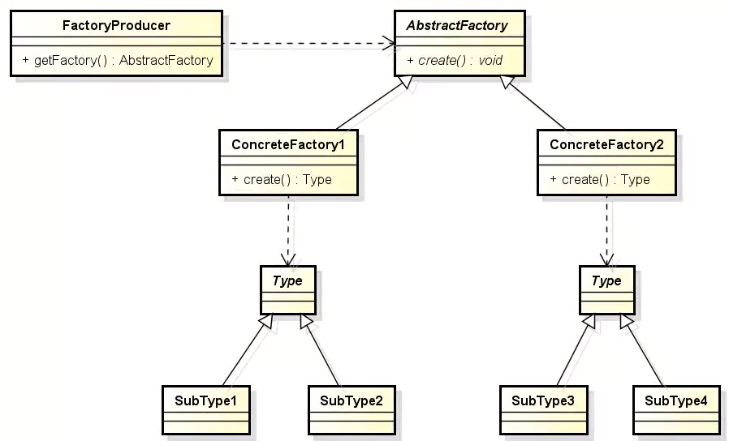

# Abstract Factory

Muito parecido com o Factory Method a diferença é que aqui a própria fabrica é abstrata. Cada factory "cria membros da própria família", ou seja, cada uma trabalha com uma família de tipos.

Obs.: Pode ser uma classe abstrata ou interface.

**Problemática:** Alto acoplamento de classes ou referência circular.

**Porque ela é tão interessante?** 
Proporciona desacoplamento, facilita manutenção futura e a extensão de código, pois se você precisar outros produtos de uma mesma família, basta criar essas classes e mexer nas factories que instânciam, não precisa se preocupar com a classe "App" como no exemplo.

**Soluções:** [Usando formas geométricas](src/github/factorymethod/shape/ShapeFactory.java).

**Arquitetura:** 

