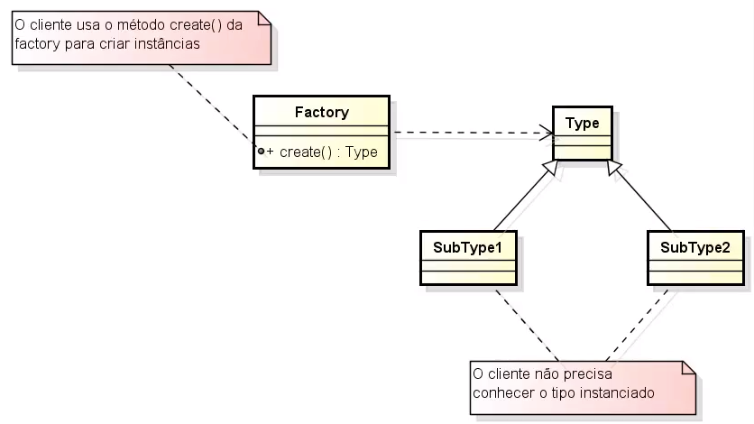

# Factory Method

É um método que fabríca objetos.

**Problemática:** Alto acoplamento de classes ou referência circular.

**Porque ela é tão interessante?** 
Por causa do desacoplamento que ela permite, porque para o cliente não importa a implementação concreta somente a interface ou classe abstrata.

**Soluções:** [Usando formas estáticas e dinâmicas](src/github/factorymethod/shape/ShapeFactory.java).

**Arquitetura:** 

