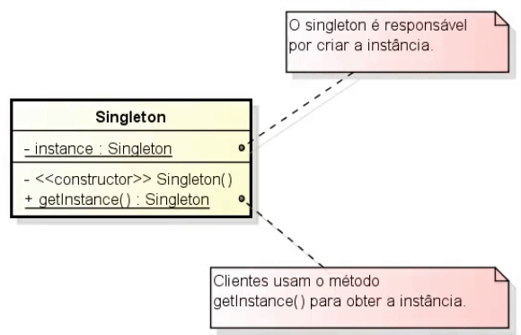

# Singleton

O padrão mais usado e o mais simples.

**Problemática:** Vamos dizer que você identificou uma necessidade em que uma classe não possa ter mais de uma instancia, o Singleton resolve esse problema.

**Soluções:** [Usando Lazyload](src/github/singleton/SecurityManager1.java), [Criando ao inciar a aplicação](src/github/singleton/SecurityManager2.java), [Em ambientes multi-thread](src/github/singleton/SecurityManager3.java).

**Arquitetura:** 

