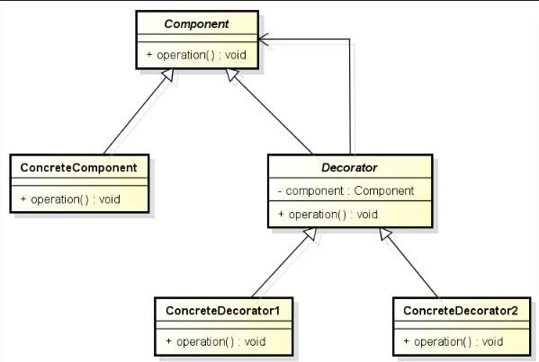

# Decorator

É uma alternativa à herança, também conhecido como Wrapper, porque basicamente o que ele faz é "decorar" um objeto, ele encapsula o objeto e agrega funcionalidades a ele.

**Problemática:** Está trabalhando com herança e está sendo necessário criar muitas classes.

**Porque ela é tão interessante?** 
Permite que você ao invés de utilizar várias camadas de herança compor objetos cada vez mais complexos um sobre o outro adicionando camadas flexíveis de comportamento.

**Soluções:** [Usando interface_para_compor_decorators_adicionando_camadas_de_comportamento](src/github/decorator/shape/ShapeDecorator.java).

**Arquitetura:** 

