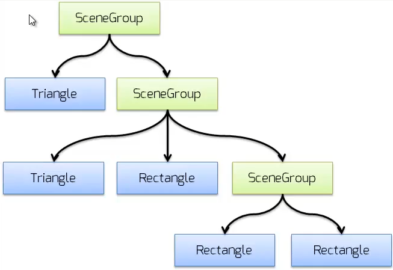

# Composite

- Permite que você componha hirarquias complexas de objetos conhecidos como galhos (composite, que são os objetos agrupadores) e folhas (leaf, que são os objetos fim), tornando possível que uma chamada de método seja delegada até todas as extremidades da árvore.

*Fato interessante: É possível notar que algumas linguagens modernas como o Dart no Flutter bebem muito desse padrão em seus componentes, [veja a documentação](https://flutter.dev/docs).* 

**Problemática¹:** Precisa desenhar numa interface de objetos auto contidos (que herdam da mesma interface) como nas listas verticais com listas horizontais, ambas são listas e ao desenhar a principal seus galhos e folhas surgem.

**Problemática²:** Precisa de várias validações em cadeia como por exemplo de uma lista de itens de venda, mas as regras de validação mudam constantemente de acordo com as leis vigentes.

**Porque ela é tão interessante?** 
Facilita manutenção futura e a extensão de código, uma vez que permite que você altere as formas de validação ou de contrução de uma árvore de objetos de forma simples e centralizada.

**Soluções:** [Exemplo... (Explore as possíbilidades)](src/github/composite/App.java).

**Arquitetura:** 

**Exemplo de hierarquia complexa de objetos (árvore):** 

